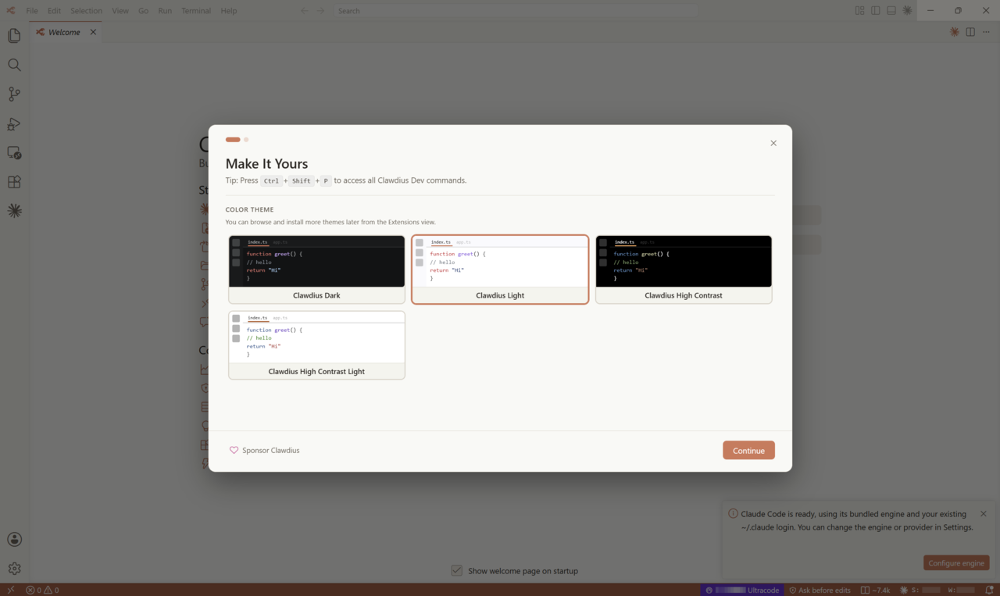
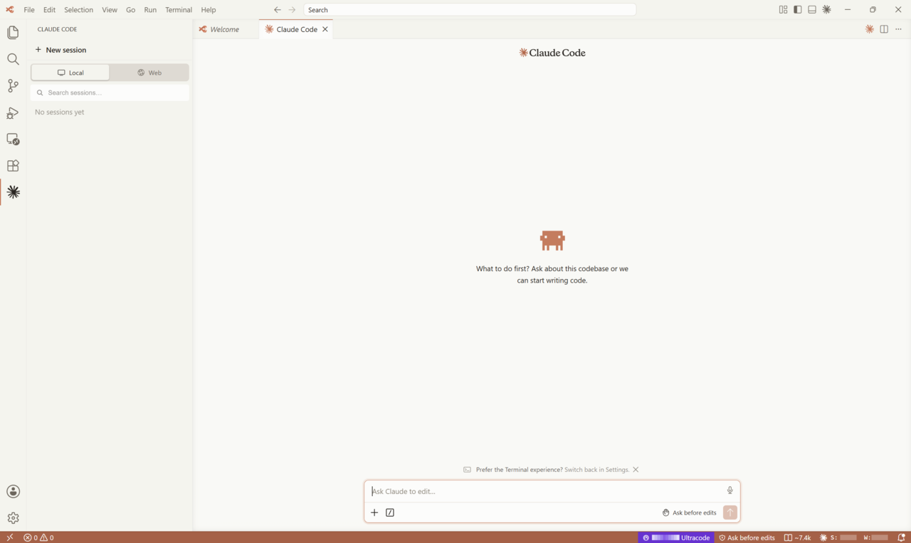
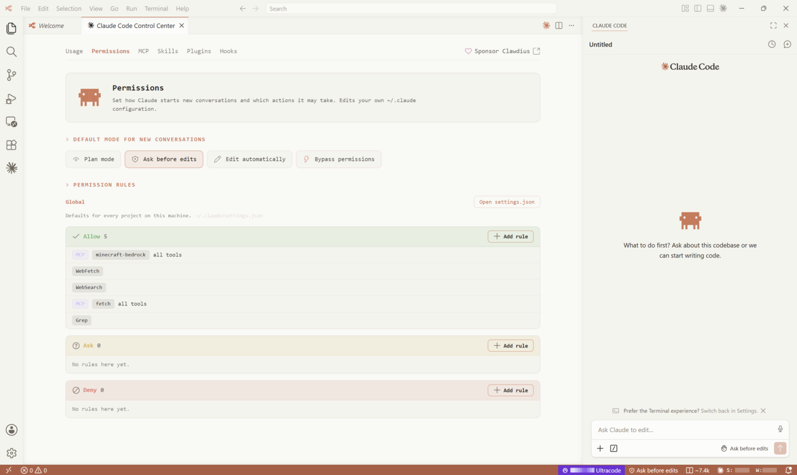
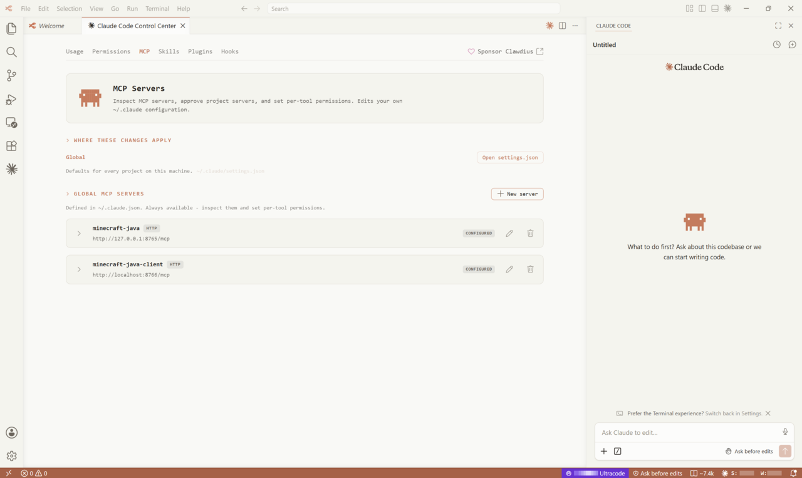
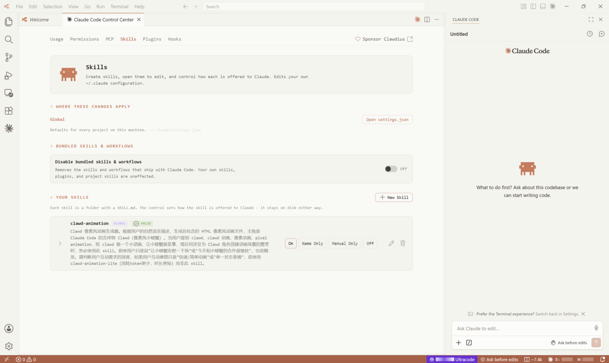
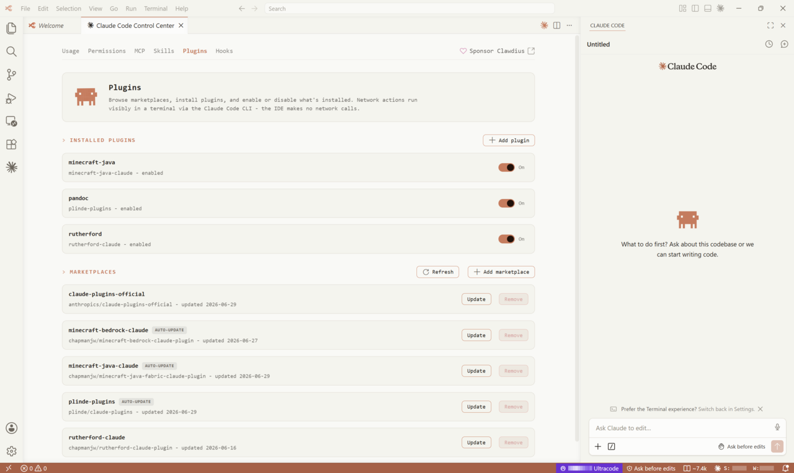
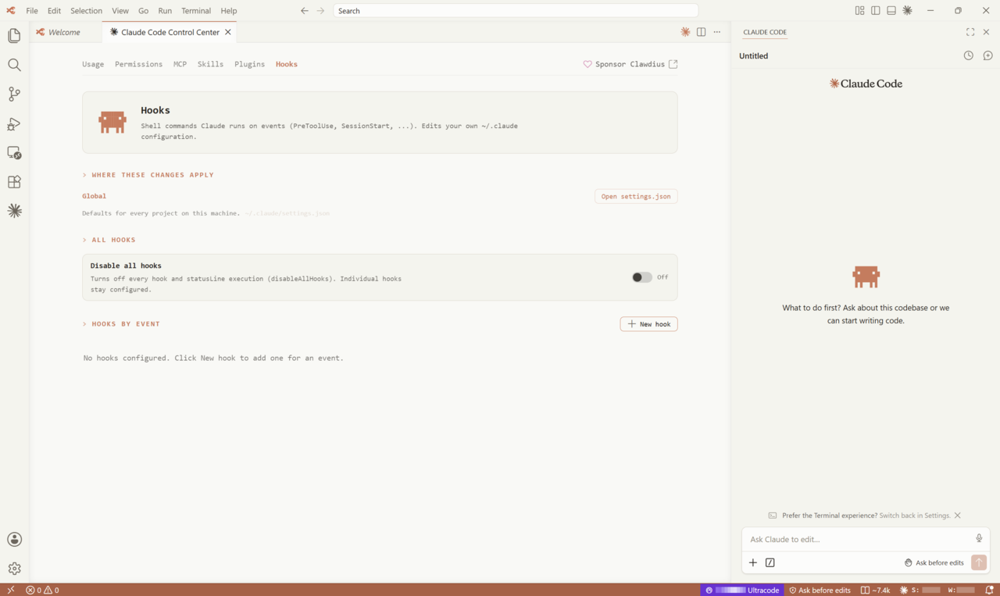
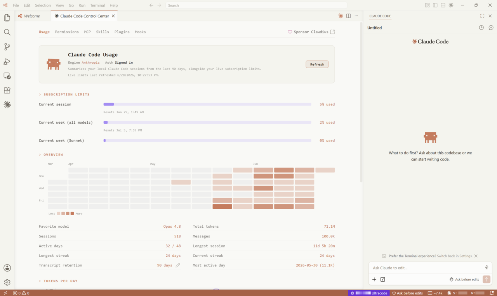
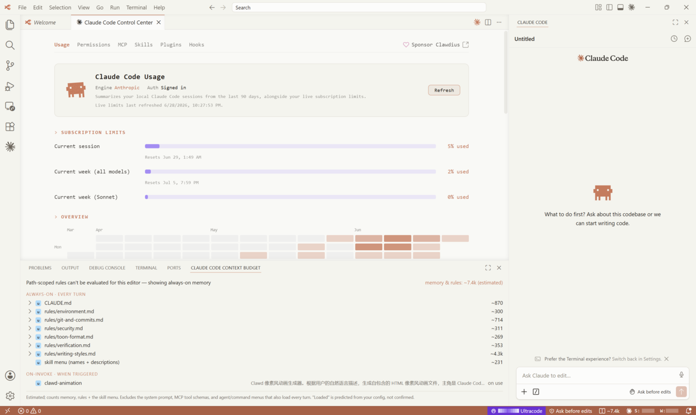

<div align="center">


# Clawdius

**A 💌 love letter to Visual Studio Code, Claude Code, and Clawd.**

[](https://github.com/chapmanjw/clawdius/stargazers)

[](https://github.com/chapmanjw/clawdius/releases)
[](LICENSE.txt)
[](https://github.com/sponsors/chapmanjw)

</div>

Clawdius is a fork of Visual Studio Code, built and styled around the official **Claude Code** plugin from Anthropic. On top of the editor you already know, it adds native tools to track your usage, configure Claude Code without hand-editing JSON, estimate what fills your context window, and keep your token spend in check. It works with the Claude Code providers you already have — a Claude subscription, AWS Bedrock, Google Vertex, or a custom endpoint — and slots into the Claude Code workflows you use today.

<picture>
  <source media="(prefers-color-scheme: dark)" srcset="docs/images/Intro-Dark.png">
  <source media="(prefers-color-scheme: light)" srcset="docs/images/Intro-Light.png">
  
</picture>

## Why Clawdius

- The real Claude Code, not a clone. Clawdius installs Anthropic's official Claude Code plugin from [Open VSX](https://open-vsx.org) on first run and drives it with your existing `~/.claude` login. No reimplementation, no second account.
- Your providers, your terms. A Claude subscription, AWS Bedrock, Google Vertex, or a custom endpoint — Clawdius uses whatever your Claude Code is already configured for.
- Quiet by default. No telemetry, no crash reporting, no marketplace or update pings. The only network traffic is the kind you start, like a Claude turn or an extension you choose to install.
- Token awareness, built in. See your session and weekly usage at a glance, and know what Claude loads for the file you are editing before you spend on it.

## Inside Clawdius

### Claude Code, built in

The official Claude Code pane opens in the sidebar, signed in and ready, powered by the same engine as the CLI. Clawdius retires VS Code's Copilot chat and makes Claude the default, so the assistant you reach for is the genuine article.

<picture>
  <source media="(prefers-color-scheme: dark)" srcset="docs/images/ClaudeCode-Dark.png">
  <source media="(prefers-color-scheme: light)" srcset="docs/images/ClaudeCode-Light.png">
  
</picture>

### The Control Center

A native pane that edits your `~/.claude` configuration so you never have to touch raw JSON. Each tab maps to a part of Claude Code you would otherwise tune by hand.

Permissions — review and edit allow/ask/deny rules and the active permission mode.

<picture>
  <source media="(prefers-color-scheme: dark)" srcset="docs/images/Permissions-Dark.png">
  <source media="(prefers-color-scheme: light)" srcset="docs/images/Permissions-Light.png">
  
</picture>

MCP — add, toggle, and inspect Model Context Protocol servers and their tools.

<picture>
  <source media="(prefers-color-scheme: dark)" srcset="docs/images/MCP-Dark.png">
  <source media="(prefers-color-scheme: light)" srcset="docs/images/MCP-Light.png">
  
</picture>

Skills — enable or disable the skills Claude can call on.

<picture>
  <source media="(prefers-color-scheme: dark)" srcset="docs/images/Skills-Dark.png">
  <source media="(prefers-color-scheme: light)" srcset="docs/images/Skills-Light.png">
  
</picture>

Plugins — browse the marketplace and manage installed Claude Code plugins.

<picture>
  <source media="(prefers-color-scheme: dark)" srcset="docs/images/Plugins-Dark.png">
  <source media="(prefers-color-scheme: light)" srcset="docs/images/Plugins-Light.png">
  
</picture>

Hooks — wire up lifecycle hooks with a structured editor instead of editing settings by hand.

<picture>
  <source media="(prefers-color-scheme: dark)" srcset="docs/images/Hooks-Dark.png">
  <source media="(prefers-color-scheme: light)" srcset="docs/images/Hooks-Light.png">
  
</picture>

### Usage at a glance

A status-bar meter and a full dashboard report your session and weekly token use, computed locally from your Claude Code transcripts. The dashboard breaks usage down by window and model so you can see where your budget goes — and it refreshes only when you open it, never in the background.

<picture>
  <source media="(prefers-color-scheme: dark)" srcset="docs/images/Usage-Dark.png">
  <source media="(prefers-color-scheme: light)" srcset="docs/images/Usage-Light.png">
  
</picture>

### Context Budget Inspector

For the file you are editing, the inspector lists what Claude actually loads — memory, rules, and skills — split into what applies every turn, what loads on demand, and what is skipped, each with an estimated token cost. It also shows the measured cached prefix from your last session, so the estimate has a real number to stand next to.

<picture>
  <source media="(prefers-color-scheme: dark)" srcset="docs/images/ContextBudget-Dark.png">
  <source media="(prefers-color-scheme: light)" srcset="docs/images/ContextBudget-Light.png">
  
</picture>

## Install

> **Alpha note:** the first signed release is in progress. Until then, builds on the [Releases](https://github.com/chapmanjw/clawdius/releases) page are unsigned, so your operating system may warn on first launch. The per-platform steps below cover how to proceed.

Grab the build for your platform from the [Releases](https://github.com/chapmanjw/clawdius/releases) page.

### Windows

Choose an installer (`<arch>` is `x64` or `arm64`):

- `ClawdiusUserSetup-<arch>.exe` — installs for the current user, no administrator rights needed. Recommended.
- `ClawdiusSystemSetup-<arch>.exe` — installs for all users (requires administrator).
- `Clawdius-win32-<arch>.zip` — portable; unzip and run `Clawdius.exe`.

If SmartScreen warns about an unrecognized app, choose **More info → Run anyway**.

### macOS (Apple Silicon)

Download `Clawdius-darwin-arm64.dmg`, open it, and drag Clawdius into Applications. Until builds are notarized, Gatekeeper blocks the first launch — right-click the app and choose **Open**, or clear the quarantine flag:

```bash
xattr -dr com.apple.quarantine /Applications/Clawdius.app
```

Intel Macs are not built yet.

### Linux

Pick the package for your distribution and architecture (`x64` or `arm64`):

```bash
# Debian / Ubuntu
sudo apt install ./clawdius_<version>_<arch>.deb

# Fedora / RHEL / openSUSE
sudo dnf install ./clawdius-<version>.<arch>.rpm

# Portable tarball
tar -xf Clawdius-linux-<arch>.tar.gz && ./Clawdius-linux-<arch>/bin/clawdius
```

Hosted apt and rpm repositories are coming with the first signed release.

### Snap

```bash
sudo snap install --classic --dangerous ./clawdius_<version>_amd64.snap
```

The `--dangerous` flag is needed until the snap is published to the Snap Store. Snap is x64 only for now.

### Build from source

Clawdius builds with the upstream VS Code toolchain on Windows, macOS, and Linux. See [docs/BUILD.md](docs/BUILD.md) for the exact prerequisites. In short:

```bash
npm ci
npm run compile
./scripts/code.sh      # on Windows: scripts\code.bat
```

## Privacy

Clawdius makes no network call you did not ask for. Telemetry, crash reporting, experiment fetches, and update and marketplace pings are off. Extensions install from Open VSX, and the only outbound traffic is what you initiate — a Claude turn, or an extension or update you choose to fetch.

## Project documentation

- [docs/BUILD.md](docs/BUILD.md) — build and run from source.
- [docs/CONTRIBUTING.md](docs/CONTRIBUTING.md) — how to contribute.
- [docs/SECURITY.md](docs/SECURITY.md) — reporting security issues.
- [docs/CHANGES_AGAINST_UPSTREAM.md](docs/CHANGES_AGAINST_UPSTREAM.md) — every change this fork makes against Code - OSS, and why.
- [docs/MERGING.md](docs/MERGING.md) — how Clawdius tracks and merges newer upstream releases.

## License and trademarks

Clawdius is licensed under the MIT License, the same as Code - OSS; see [LICENSE.txt](LICENSE.txt).

"Visual Studio Code", "VS Code", and the Microsoft logos are trademarks of Microsoft and are not used by this fork. "Claude" and "Claude Code" are products of Anthropic. Clawdius is an independent fork — not affiliated with, sponsored by, or endorsed by Anthropic or Microsoft.

If Clawdius is useful to you, a ⭐ on the repo helps, and you can [sponsor the project](https://github.com/sponsors/chapmanjw) to support its development.

## Star History

<a href="https://www.star-history.com/?repos=chapmanjw%2Fclawdius&type=date&legend=top-left">
 <picture>
   <source media="(prefers-color-scheme: dark)" srcset="https://api.star-history.com/chart?repos=chapmanjw/clawdius&type=date&theme=dark&legend=top-left" />
   <source media="(prefers-color-scheme: light)" srcset="https://api.star-history.com/chart?repos=chapmanjw/clawdius&type=date&legend=top-left" />
   
 </picture>
</a>
